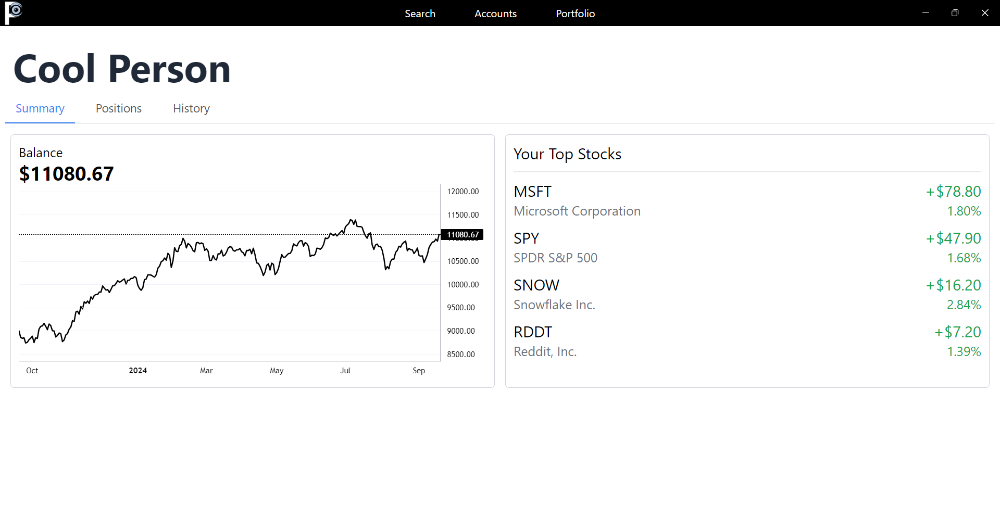
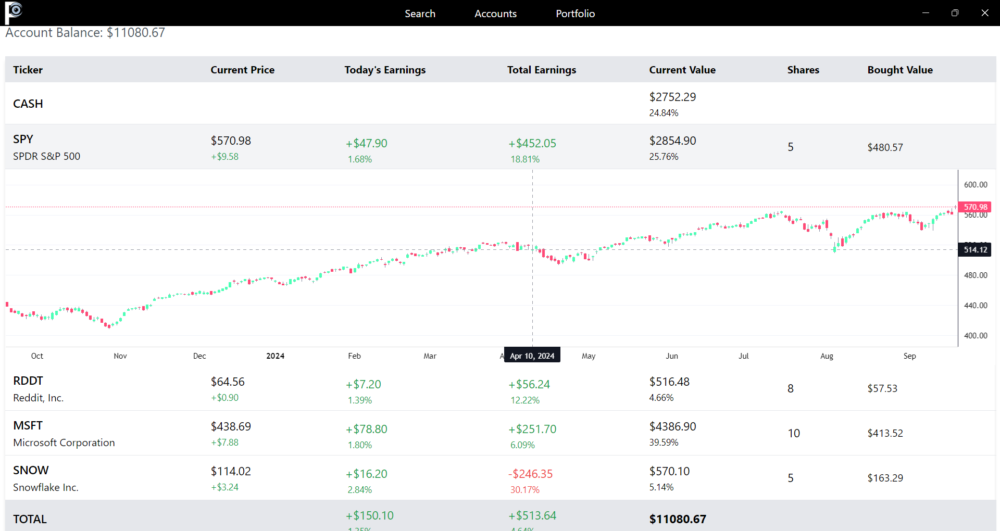
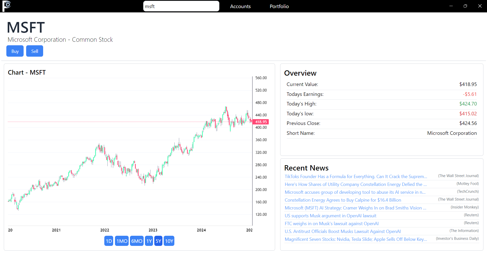

# paper-trader

An paper trading electron application built ElectronJS, React and TypeScript
## Summary Page

## Positions Page

## Stock Info Page

## Functionality
This app provides a risk-free environment for users to practice financial skills by simulating stock trading. Users can create accounts with a set amount of "cash"(not real) and use it to "buy" or "sell" stocks based on real-time price data and recent news articles, so they can make informed descisions. Over time, users can track their gains and analyze their performance to refine their strategies. The app also allows multiple accounts, enabling users to experiment with different trading styles and approaches.

## Recommended IDE Setup

- [VSCode](https://code.visualstudio.com/) + [ESLint](https://marketplace.visualstudio.com/items?itemName=dbaeumer.vscode-eslint) + [Prettier](https://marketplace.visualstudio.com/items?itemName=esbenp.prettier-vscode)

## Project Setup

### Install

```bash
$ yarn
```

### Development

```bash
$ yarn dev
```

### Build

```bash
# For windows
$ yarn build:win

# For macOS
$ yarn build:mac

# For Linux
$ yarn build:linux
```

